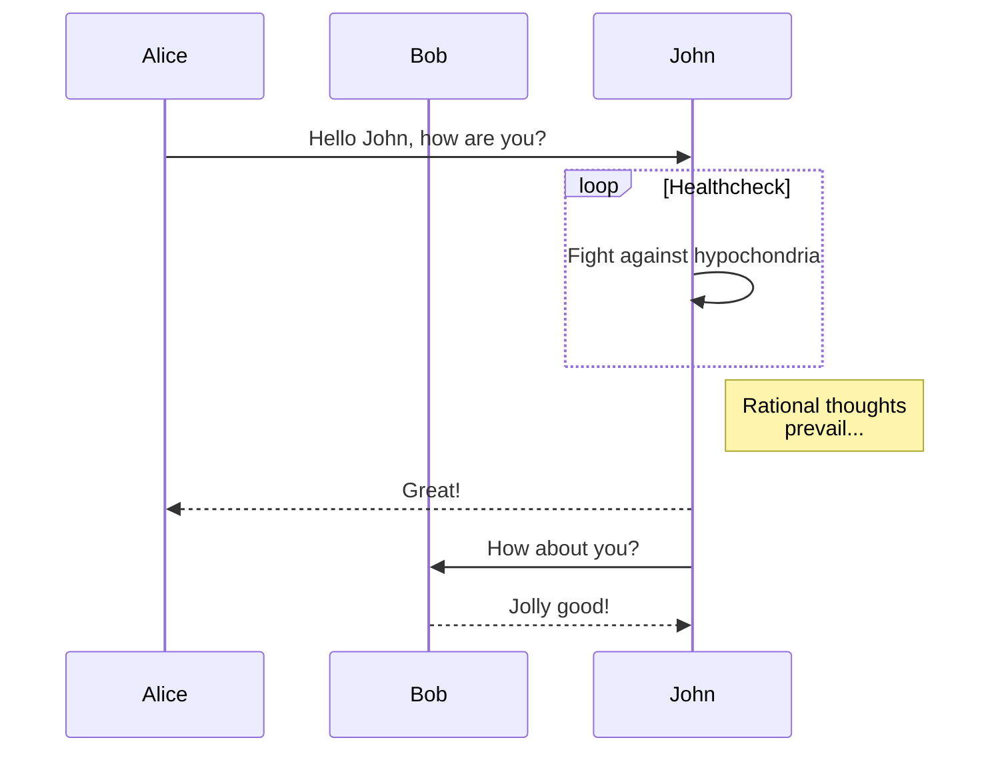

# LLM 流式Markdown 渲染器组件

支持所有markdown基础特性以及echarts、mermaid图表和数学公式。

## ✨ 功能特性

- **标准 Markdown 支持**: 基于 `vue-markdown-stream`，支持所有标准的 Markdown 语法。
- **数学公式 (LaTeX)**: 集成 `markdown-it-texmath` 和 `KaTeX`，支持行内 (`$...$`) 和块级 (`$$...$$`) 的 LaTeX 数学公式渲染。
- **Emoji**: 支持 `:emoji:` 语法。
- **Mermaid 图表**: 支持通过 `mermaid` 围栏代码块渲染流程图、序列图、甘特图等。
  - 内置加载动画、错误提示与重试机制。
  - 支持下载图表为 PNG 图片。
- **Echarts 图表**: 支持通过 `echarts` 围栏代码块，使用 JSON 配置来渲染数据可视化图表。
  - 内置加载动画。
  - 支持下载图表为 PNG 图片。
- **精美的默认样式**: 为标题、表格、代码块、引用等元素提供了 Github 风格的优化样式。

## 📦 安装依赖

在使用此组件前，请确保你的项目中已经安装了以下必要的依赖：

```bash
# Markdown 渲染核心
npm install vue-markdown-stream

# 插件
npm install markdown-it-emoji markdown-it-texmath katex

# 图表支持
npm install echarts mermaid
```

## 🚀 使用方法

1.  **引入组件**: 在你的 Vue 组件中，引入 `MarkdownRenderer.vue`。

    ```vue
    <script setup>
    import { ref } from 'vue';
    import MarkdownRenderer from './components/markdown/MarkdownRenderer.vue';

    const markdownContent = ref(`
    # 这是一个标题

    这里是普通文本，包含一个 :smile: emoji。

    $$
    L = \frac{1}{2} \rho v^2 S C_L
    $$

    \`\`\`mermaid
    graph TD;
        A-->B;
        A-->C;
        B-->D;
        C-->D;
    \`\`\`

    \`\`\`echarts
    {
      "xAxis": {
        "type": "category",
        "data": ["Mon", "Tue", "Wed", "Thu", "Fri", "Sat", "Sun"]
      },
      "yAxis": {
        "type": "value"
      },
      "series": [{
        "data": [150, 230, 224, 218, 135, 147, 260],
        "type": "line"
      }]
    }
    \`\`\`
    `);
    </script>

    <template>
      <div>
        <MarkdownRenderer :content="markdownContent" />
      </div>
    </template>
    ```

2.  **Props**:

    - `content` (String, required): 需要渲染的 Markdown 字符串。

## 🎨 语法示例

### 数学公式 (KaTeX)

- **行内公式**: `这是一个行内公式 $E=mc^2$`
- **块级公式**:
  ```
  $$
  \int_{-\infty}^{\infty} e^{-x^2} dx = \sqrt{\pi}
  $$
  ```

### Mermaid 图表

使用 `mermaid` 或 `mermaidChart` 作为围栏代码块的语言标识符。

````

````

### Echarts 图表

使用 `echarts` 作为围栏代码块的语言标识符，内容为 Echarts 的 `option` 的 JSON 字符串。

````
```echarts
{
  "title": { "text": "堆叠区域图" },
  "tooltip": { "trigger": "axis" },
  "legend": { "data": ["邮件营销", "联盟广告"] },
  "grid": { "left": "3%", "right": "4%", "bottom": "3%", "containLabel": true },
  "xAxis": { "type": "category", "boundaryGap": false, "data": ["周一", "周二", "周三"] },
  "yAxis": { "type": "value" },
  "series": [
    { "name": "邮件营销", "type": "line", "stack": "总量", "areaStyle": {}, "data": },
    { "name": "联盟广告", "type": "line", "stack": "总量", "areaStyle": {}, "data": }
  ]
}
```
````

## 💅 样式自定义

组件自带了一套完整的样式。如果你需要自定义，可以直接覆盖 `MarkdownRenderer.vue` 中的样式。为了避免全局样式污染，建议将样式封装在组件的 `scoped` 中，或提取为单独的 CSS 文件按需引入。
